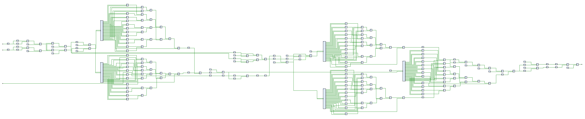

# NodalHDL

[中文](./README.md) | [English](./README_en.md)

## NodalHDL 是什么？

（预期中这是）一套紧密嵌入 Python 工作流的领域专用架构（DSA）设计工具链，支持自动流水化、高层次综合等特性，并配有可视化编辑器、仿真调试工具、板级支持包等辅助工具。

（不过现在只是）一套紧密嵌入 Python 工作流的流水线数字电路设计工具链，支持**自动流水化**、**组合逻辑高层次综合**等特性，并配有可视化但暂不可编辑器等辅助工具。

> 总的来说即使用 Python 代码描述行为，直接生成 HDL 代码。

NodalHDL 中提供一种数据结构用于描述电路结构，称为结构描述（Structure）。其形似电路框图，由节点（Node）、线网（Net）和子结构组合而成。结构描述层上承行为描述层（基于 Python 语法的高层次综合特性），下接硬件描述语言模型层，起到中间表示的作用。其包含一套类型系统，支持进行修改、自动类型推导、复用、持久化存取等操作，具有较强的可读性。

## 快速开始

### 安装

使用 `pip install` 安装即可。鉴于本项目仍在开发中，可考虑使用 `pip install -e . --config-settings editable_mode=compat` 以可编辑模式安装，或直接指定路径导入。

### HDL 生成实例

以一个简单例子说明该项目的用途，工程见 [hdmi_ddr3_fragment_shader_proj](https://github.com/Gralerfics/hdmi_ddr3_fragment_shader_proj)。以 Shadertoy 上的一个作品 [Pretty Hip](https://www.shadertoy.com/view/XsBfRW) 为例，参考其算法编写如下 Python 脚本：

```python
from nodalhdl.py.std import mux, sfixed, uint
from nodalhdl.py.glsl import vec2, vec4, fract, ceil, min, clamp

T = SFixedPoint[16, 12]

def shader(iTime_us_u64: ComputeElement, fragCoord_u12: vec2) -> ComputeElement:
    iTime_us = sfixed(iTime_us_u64, T.W_int + 20, T.W_frac)
    iTime_s = sfixed(iTime_us >> 20, T.W_int, T.W_frac)
    
    fragCoord = vec2(sfixed(fragCoord_u12.x, T.W_int, T.W_frac), sfixed(fragCoord_u12.y, T.W_int, T.W_frac))
    
    a = vec2((fragCoord.x >> 9) + (fragCoord.x >> 7) - 5, (fragCoord.y >> 9) + (fragCoord.y >> 7) - 3.75)
    u = vec2(a.x - a.y + 5, a.x + a.y + 5)
    f = fract(u)
    f = min(f, 1 - f)
    v = ceil(u) - 5.5
    
    s = 1 + ((v.x * v.x + v.y * v.y) >> 3)
    e = (fract((iTime_s - (s >> 1)) >> 2) << 1) - 1
    t = fract(min(f.x, f.y) << 2)
    
    rampFactor = 0.95 * mux(e[e.type.W - 1], 1 - t, t) - e * e
    mixFactor = clamp((rampFactor << 4) + (rampFactor << 2) + 1, 0, 0.9999) + s * 0.1
    
    fragColor = clamp(vec4(1 - (mixFactor >> 1), 1 - (mixFactor >> 2), 0.9999, 0.9999), 0, 0.9999)
    return uint(fragColor.r << 8, 8) @ uint(fragColor.g << 8, 8) @ "11111111"
```

该函数描述了一个片段着色器的算法逻辑，输入屏幕像素坐标和时间戳，返回对应的颜色值，从而形成动画效果。创建端口，利用该函数可自动构建结构（Structure）对象，再通过调用一些常规流程（静态时序分析、自动流水化、HDL 生成并输出）得到 HDL 文件，详见 `./examples/test_py_shader_pretty_hip.py`。

手动添加 SDRAM 双缓冲、HDMI 输出等外围电路后（后续期望可以对异步访存、仲裁、并行等结构的生成完成自动化，并添加对 HDMI 等外设的支持），部署到 FPGA 平台验证，效果如下图所示。


核心部分未进行流水化时的结构如下图所示：



## 设计文档

（TODO）关于项目结构设计的细节，例如抽象层次、对象引用关系的设计以及代码实现等。

目前只有一篇稀烂的本科毕业论文介绍了一下项目结构，内容还有些过期。尚未毕业，暂不上传，后续重新撰写。

## 部分计划

- [x] 结构描述层（Structural Description Layer）
  - [x] 类型系统（Type System）
    - [x] 重构 IO 包装和信号束类型（Refactor IOWrapper and Bundle Type）
    - [ ] 信号束的拆分和聚合操作（Bundle Type De/Composition）
  - [x] 结构工作流（Structure Workflow）
    - [x] 结构复制（Duplicate）
    - [x] 多实例结构的剥离（Strip）
    - [x] 结构单例化（Singletonize）
    - [x] 内部结构展开（Substructure Expanding）
      - [ ] 选择性展开（Selectively Expanding）
    - [x] 运行时信息与自动类型推导（Type Inference）
    - [x] HDL 生成（HDL Generation）
    - [x] 持久化存储（Persistence）
      - [ ] 类型池的一致性问题（Consistence Issues）
    - [x] 静态时序分析（STA）
      - [x] 自动复用分析结果缓存（STA Results Buffering）
      - [x] 多进程子模块综合与分析（Multiprocessing）
      - [ ] 其他 STA 工具支持（Support for Other STA Tools）
      - [ ] 相同结构输入不同时时序差异的问题，如常数输入（Timing Features Influenced by Different Inputs）
    - [ ] 内部结构快速拆分（Fast Decomposition）
    - [ ] 结构层仿真（Simulation）
  - [x] 常用结构生成函数（Useful Structures Generators）
    - [x] 位运算器（Bitwise Operators）
    - [x] 加 / 减 / 乘法器等（Adder / Subtractor / Multiplier, etc.）
    - [x] 定点数除法器（FxP Division）
    - [ ] CORDIC 模块（CORDIC Module）

- [x] 硬件描述语言层（HDL Model Layer）
  - [ ] Verilog 完整支持（Verilog Support）
  - [ ] 生成文件夹结构（Folder Structure）

- [x] 高层次综合特性（HLS Features）
  - [x] 重定时 / 流水化（Retiming / Pipelining）
    - [ ] 关键时序路径返回（Bottleneck Hinting）
    - [ ] 自动流水线级数选取（Automatic Stages Picking）
    - [ ] 提高效率（Accelerated Algorithms）
    - [ ] 引入自带流水级数的基本算子（Support Internal Pipeline Stages）
    - [ ] 修复扩展模型重定时的问题（Fix Extended Model）
  - [x] 组合逻辑生成（Combinational Logic Generation）
    - [x] 常用运算符重载，如加减乘、移位、切片等（Common Operations, e.g. +/-, Shifting, Slicing）
    - [x] 常用标准函数，如类型转换等（Standard Functions, e.g. Type Conversions）
    - [x] 仿 GLSL 的向量操作及函数（GLSL-like Vector Behaviors）
    - [ ] 添加中间层，如计算图，现在这个结构感觉不好扩展（Intermediate Layers, e.g. Computational Graph）
  - [ ] 状态机 / 时序逻辑生成（FSM & Sequential Logic Generation）
    - [ ] 浮点数运算单元（FPU）
  - [ ] 模块拼接，关于Ready-valid 握手、反压、打断设计（Module Concatenation）
  - [ ] 跨时钟域结构的生成，如FIFO、异步访存等（Clock Crossings）
  - [ ] 并行化结构的生成，如仲裁模块等（Concurrent Structures）

- [ ] 辅助工具链（Complementary Toolchain）
  - [ ] [可视化编辑器](https://github.com/Gralerfics/nodalhdl_editor)（Visual Editor）
  - [ ] 包含图像输出等功能的仿真器（Simulator）
  - [ ] HDMI、UART 等常用外设驱动模块的生成（Peripherals Generation）
  - [ ] Vivado 等工程文件生成（Project Generation）
  - [ ] 添加对其他开源综合、布局布线工具链的支持（Support for Other Synthesis / P&R Toolchains）

- [ ] 其他（Miscellaneous）
  - [ ] 异常处理体系（Exception Handling）

## 声明

部分想法来源于 [PipelineC](https://github.com/JulianKemmerer/PipelineC)。

依赖项请查看 `pyproject.toml`。

以及我不是微电子专业，也不会查文献，现在我有点怀疑我这个项目存在的意义。

