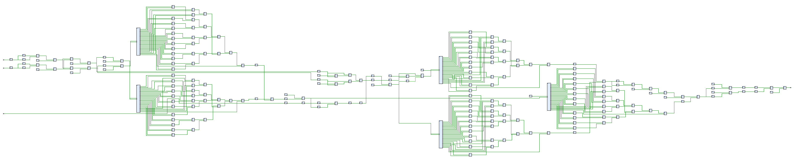

# NodalHDL

[中文](./README.md) | [English](./README_en.md)

## What is NodalHDL?

**(This is expected to be)** A domain-specific architecture (DSA) design toolchain that is tightly embedded in the Python workflow, supports features such as automatic pipelining and high-level synthesis, and is equipped with auxiliary tools such as visual editors, simulation debugging tools, and board support packages.

**(But now it's just)** A set of **pipeline digital circuit** design tools tightly embedded in the Python workflow, supporting **automatic pipelining**, **combinatorial logic high-level synthesis** and other features, and equipped with "visual but not yet editor" and other auxiliary tools.

> In general, use Python code to describe the behavior and directly generate HDL code.

NodalHDL provides a data structure for describing circuit structure, called `Structure`. It is similar to a circuit block diagram and is composed of `Node`, `Net` and substructures. The **Structure description layer** lies under the **Behavior description layer** (high-level synthesis features based on the Python syntax) and above the **Hardware description language model layer**, playing the role of intermediate representation.

`Structure` contains a set of type systems, supports modification, automatic type deduction, reusing, persistent access and other operations, and has strong readability.

## Getting Started

### Installation

You can use `pip install` to install. Since this project is still under development, you can consider using `pip install -e . --config-settings editable_mode=compat` to install in editable mode, or directly specify the path to import.

### Example: HDL generation for a fragment shader

Let's take a simple example to illustrate the purpose of this project and the project files can be found [here](https://github.com/Gralerfics/hdmi_ddr3_fragment_shader_proj).

Take a work [Pretty Hip](https://www.shadertoy.com/view/XsBfRW) on Shadertoy as an example, and write the following Python script based on its algorithm:

```python
from nodalhdl.py.std import mux, sfixed, uint
from nodalhdl.py.glsl import vec2, vec4, fract, ceil, min, clamp

T = SFixedPoint[16, 12]

def shader(iTime_us_u64: ComputeElement, fragCoord_u12: vec2) -> ComputeElement:
    iTime_us = sfixed(iTime_us_u64, T.W_int + 20, T.W_frac)
    iTime_s = sfixed(iTime_us >> 20, T.W_int, T.W_frac)
    
    fragCoord = vec2(sfixed(fragCoord_u12.x, T.W_int, T.W_frac), sfixed(fragCoord_u12.y, T.W_int, T.W_frac))
    
    a = vec2((fragCoord.x >> 9) + (fragCoord.x >> 7) - 5, (fragCoord.y >> 9) + (fragCoord.y >> 7) - 3.75)
    u = vec2(a.x - a.y + 5, a.x + a.y + 5)
    f = fract(u)
    f = min(f, 1 - f)
    v = ceil(u) - 5.5
    
    s = 1 + ((v.x * v.x + v.y * v.y) >> 3)
    e = (fract((iTime_s - (s >> 1)) >> 2) << 1) - 1
    t = fract(min(f.x, f.y) << 2)
    
    rampFactor = 0.95 * mux(e[e.type.W - 1], 1 - t, t) - e * e
    mixFactor = clamp((rampFactor << 4) + (rampFactor << 2) + 1, 0, 0.9999) + s * 0.1
    
    fragColor = clamp(vec4(1 - (mixFactor >> 1), 1 - (mixFactor >> 2), 0.9999, 0.9999), 0, 0.9999)
    return uint(fragColor.r << 8, 8) @ uint(fragColor.g << 8, 8) @ "11111111"
```

This function describes the behavior of a fragment shader, accepts pixel coordinates and timestamps, and returns the corresponding color value, thus forming an animation effect. Create ports and use this function to automatically build a structure object, and then **get the HDL files** by calling some common procedures (static timing analysis, automatic pipelining, HDL generation and output), see `./examples/test_py_shader_pretty_hip.py` for details.

After manually adding peripheral circuits such as SDRAM double buffering and HDMI output, the system is deployed to the FPGA platform for verification. The effect is shown in the figure below.

> It is expected that the generation of asynchronous memory access, arbitration, parallel and other structures can be automated, and support for peripherals such as HDMI can be added.


The structure of the major part when it is not pipelined is shown in the following figure:



## Documentation

(TODO) Details about the structural design of the project, such as the abstraction hierarchy, the design of object relationships, and the coding matters.

Currently there is only a poor undergraduate thesis describing the structure of the project, and the content is even a bit out of date. I have not yet graduated, so I will not upload it yet, and will rewrite it later.

## Development Plans

See [README.md](./README.md/#部分计划).

## Acknowledgment

Partially inspired by [PipelineC](https://github.com/JulianKemmerer/PipelineC).

Check `pyproject.toml` for dependencies.

I'm not a microelectronics major and I am too lazy to check the literature. And now I am questioning whether my project is meaningless.

